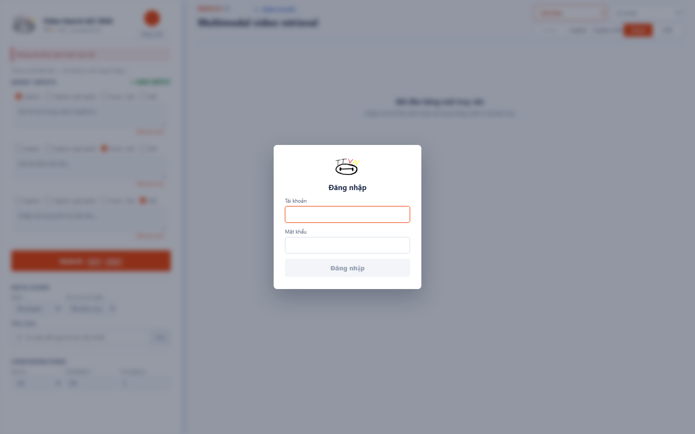
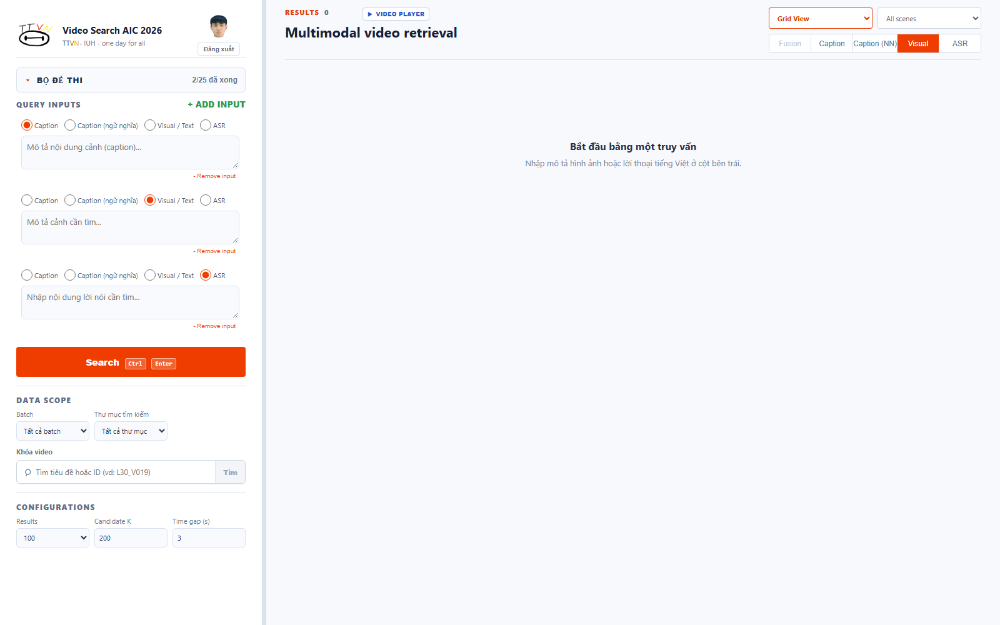
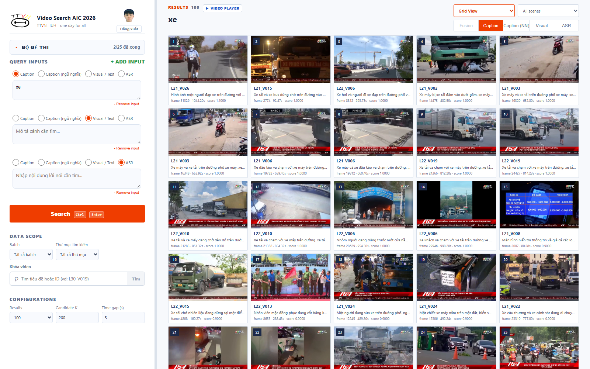
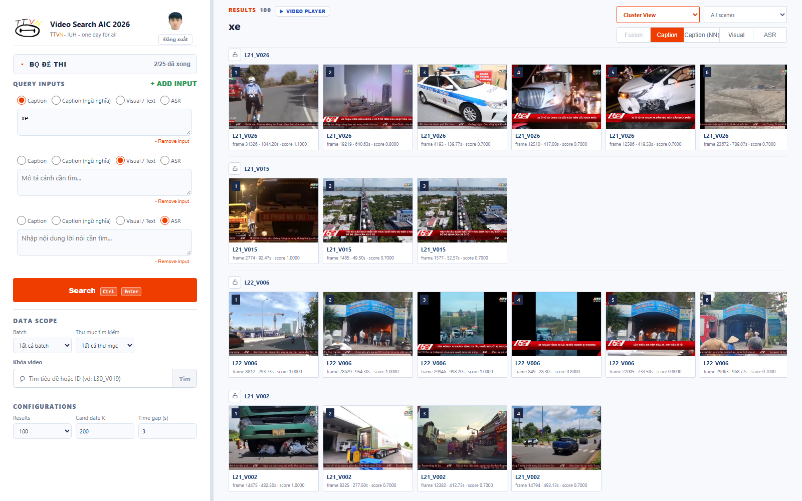
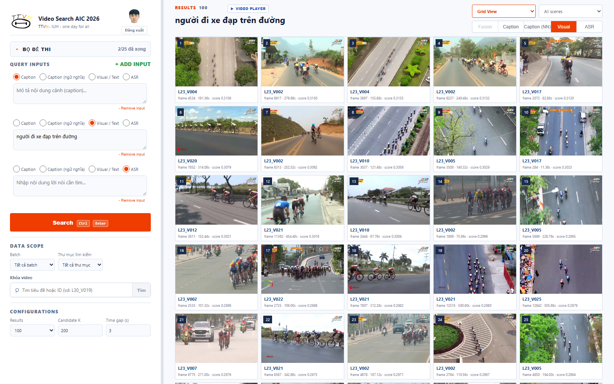
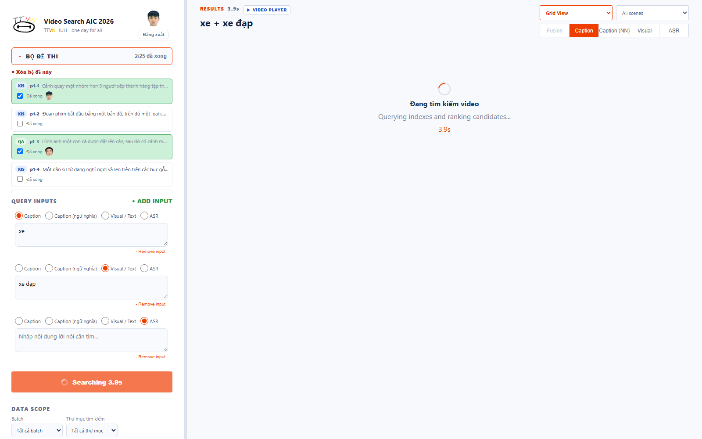

# AIC-TTVN

Hệ thống truy xuất video đa phương thức dành cho AIC, gồm giao diện React,
FastAPI, PostgreSQL, MinIO, Milvus và các pipeline trích xuất đặc trưng chạy
trên Kaggle.

Hiện tại ứng dụng hỗ trợ tìm kiếm hình ảnh bằng OpenCLIP, lời nói ASR, chữ OCR
và nhãn object detection. Dữ liệu frame-understanding/scene filter chỉ khả dụng
khi batch có output stage 06.

## Ảnh chụp giao diện

**Đăng nhập** — modal đơn giản, yêu cầu tài khoản/mật khẩu chung của nhóm.



**Màn hình chính** — cột trái là bộ đề thi (nếu có import), tối đa 3 ô truy vấn
song song (Caption/Caption ngữ nghĩa/Visual/ASR), phạm vi lọc theo batch/thư
mục/video, và cấu hình số kết quả. Cột phải hiển thị kết quả.



**Tìm kiếm Caption (Grid View)** — kết quả dạng lưới, mỗi ảnh kèm video ID,
frame, mô tả caption và điểm số liên quan.



**Tìm kiếm Caption (Cluster View)** — cùng một bộ kết quả nhưng gom nhóm theo
từng video, có nút khóa 🔒 để giới hạn tìm kiếm tiếp theo vào đúng video đó.



**Tìm kiếm Visual (OpenCLIP)** — truy vấn tiếng Việt "người đi xe đạp trên
đường" trả về đúng các cảnh đua xe đạp quay từ flycam, minh họa khả năng hiểu
ngữ nghĩa hình ảnh của OpenCLIP sau bước dịch máy Việt→Anh.



**Bộ đề thi (quản lý câu hỏi KIS/QA/TRAKE)** — danh sách câu hỏi import từ file
ZIP, đánh dấu đã xong kèm avatar người phụ trách, dùng để chọn frame/nhập đáp
án rồi xuất submission CSV đúng chuẩn ban tổ chức.



## Kiến trúc

```text
Kaggle artifacts ──> Import pipeline ──> PostgreSQL (metadata, ASR, OCR, object)
                                      ├─> Milvus (visual vectors)
                                      └─> MinIO (keyframes, artifacts)
                                                  │
React UI <────────────── FastAPI <────────────────┘
```

| Thành phần | Vai trò |
|---|---|
| `apps/frontend` | Giao diện React/Vite |
| `apps/api` | REST API và phục vụ bản frontend đã build |
| `retrieval` | Import dữ liệu, lưu trữ và tìm kiếm |
| `pipelines/kaggle` | Notebook trích xuất shot, embedding, OCR, ASR và object |
| `data/source/aic2026` | Metadata và keyframe mapping nhỏ từ ban tổ chức |
| `artifacts` | Quy ước lưu artifact; không chứa dữ liệu lớn trên Git |
| `alembic` | Migration PostgreSQL |
| `scripts` | Script cài đặt, chạy, dừng và kiểm tra repository |

## Lưu ý về dữ liệu

GitHub chỉ chứa mã nguồn và metadata nhỏ. Repository **không chứa** video,
frame ảnh, embedding, transcript ASR, dữ liệu PostgreSQL, MinIO hoặc Milvus.

Vì vậy, sau khi clone:

- Có thể dựng hạ tầng, mở UI và kiểm tra API health ngay.
- Chức năng tìm kiếm chỉ hoạt động sau khi import artifact Kaggle; trước đó API
  tìm kiếm có thể báo chưa tồn tại collection/index.
- Thành viên trong nhóm cần nhận bộ artifact từ người quản lý dự án hoặc tự
  chạy notebook Kaggle để tạo lại.

## Yêu cầu

Khuyến nghị máy có ít nhất 8 GB RAM và còn khoảng 10 GB dung lượng trống cho
dependency, Docker image và model. Dữ liệu thật sẽ cần thêm dung lượng tùy số
lượng video.

| Công cụ | Phiên bản khuyến nghị |
|---|---|
| Git | Bản mới ổn định |
| Docker Desktop | Có Docker Compose, Docker Engine đang chạy |
| Python | `3.11.x` |
| uv | `0.8+` |
| Node.js | `20+` |
| npm | Đi kèm Node.js |

Cài `uv` nếu máy chưa có:

```powershell
winget install --id=astral-sh.uv -e
```

## Chạy nhanh trên Windows

Đây là luồng được kiểm tra chính thức của repository.

### 1. Clone repository

```powershell
git clone https://github.com/toilaMif/AIC_TTVN.git
cd AIC_TTVN
```

### 2. Thiết lập lần đầu

Mở Docker Desktop, đợi Docker Engine chạy xong rồi thực hiện:

```powershell
powershell -ExecutionPolicy Bypass -File scripts/setup-local.ps1
```

Script này sẽ:

1. Tạo `.env` từ `.env.example` nếu chưa có.
2. Tạo thư mục dữ liệu local trong `.runtime`.
3. Cài dependency Python từ `uv.lock`.
4. Cài và build frontend React.
5. Khởi động PostgreSQL, MinIO, etcd và Milvus.
6. Chạy migration database.

### 3. Mở ứng dụng

```powershell
powershell -ExecutionPolicy Bypass -File scripts/start-local-ui.ps1
```

Các địa chỉ local:

| Dịch vụ | Địa chỉ |
|---|---|
| Giao diện | <http://127.0.0.1:8000/ui/> |
| API health | <http://127.0.0.1:8000/health> |
| API docs | <http://127.0.0.1:8000/docs> |
| MinIO console | <http://127.0.0.1:9001> |

### 4. Dừng hệ thống

```powershell
powershell -ExecutionPolicy Bypass -File scripts/stop-local.ps1
```

Lệnh dừng không xóa dữ liệu trong `.runtime`. Những lần sau chỉ cần chạy lại
`scripts/start-local-ui.ps1`.

## Cài đặt thủ công trên macOS/Linux

Sửa các đường dẫn trong `.env` nếu cần, sau đó chạy. Trên máy Apple Silicon,
Milvus có thể cần bật chế độ tương thích `amd64` của Docker Desktop.

```bash
cp .env.example .env
mkdir -p .runtime/postgres .runtime/minio .runtime/milvus .runtime/etcd
mkdir -p .runtime/artifacts/kaggle
uv sync --frozen
npm --prefix apps/frontend ci
npm --prefix apps/frontend run build
docker compose up -d
uv run alembic upgrade head
uv run uvicorn apps.api.main:app --host 127.0.0.1 --port 8000
```

Mở <http://127.0.0.1:8000/ui/>. Dừng API bằng `Ctrl+C`, sau đó dừng Docker:

```bash
docker compose down
```

## Nạp dữ liệu để tìm kiếm

### 1. Import metadata nguồn

Trên database mới, chạy:

```powershell
uv run python -m retrieval.cli.data audit
uv run python -m retrieval.cli.data import-metadata
```

### 2. Chuẩn bị artifact Kaggle

Tạo cấu trúc cho một batch, ví dụ `l21`:

```powershell
powershell -ExecutionPolicy Bypass -File scripts/init-kaggle-batch.ps1 -Batch l21
```

Đặt ZIP được tải từ Kaggle vào đúng stage:

```text
.runtime/artifacts/kaggle/l21/
├── 01-shot-keyframes/
├── 02-visual-embeddings/
├── 03-ocr/
├── 04-asr/
├── 05-object-detection/
├── 06-frame-understanding/
└── _runtime/
```

Ví dụ tên file:

```text
01-shot-keyframe-L21_V001.zip
02-visual-embedding-L21_V001.zip
04-asr-vietnamese-L21_V001.zip
```

Nếu artifact lớn, nên lưu ngoài repository. Ví dụ sửa `.env`:

```dotenv
AIC_KAGGLE_ARTIFACT_ROOT=D:/AIC_TTVN_DATA/artifacts/kaggle
AIC_KAGGLE_BATCH=l21
```

### 3. Rebuild chỉ mục

Kiểm tra đúng batch trong `.env`, sau đó chạy:

```powershell
uv run python scripts/rebuild_kaggle_index.py --confirm-rebuild l21
```

Nếu thư mục batch có tên khác cấu hình `.env`, có thể truyền trực tiếp (giá trị
`--confirm-rebuild` phải khớp đúng tên thư mục batch, ví dụ `l21a`):

```powershell
uv run python scripts/rebuild_kaggle_index.py `
  --output-root D:/AIC_TTVN_DATA/artifacts/kaggle/l21a `
  --confirm-rebuild l21a
```

> Cảnh báo: lệnh này xóa và dựng lại dữ liệu đặc trưng hiện tại trong
> PostgreSQL, MinIO và Milvus, không có cách khôi phục tự động. Không chạy chỉ
> để mở UI. `--confirm-rebuild` giờ bắt buộc gõ đúng tên batch (không phải cờ
> bật/tắt) để tránh xóa nhầm khi copy-paste lệnh cũ; trước khi xóa, script tự
> ghi lại số lượng bản ghi hiện có vào `data/manifests/rebuild-pre-clear-*.json`
> để tra cứu sau này (đây chỉ là bản ghi số liệu, không phải bản sao lưu có thể
> phục hồi dữ liệu).

Lần truy vấn visual đầu tiên có thể chậm do OpenCLIP tải model về máy. Các lần
sau model được dùng từ cache local.

## Tìm kiếm Visual bằng tiếng Việt (dịch máy)

OpenCLIP (`ViT-B-32/laion2b_s34b_b79k`) hiểu tiếng Anh tốt hơn hẳn tiếng Việt.
Vì vậy trước khi encode câu truy vấn Visual, hệ thống tự động dịch câu tiếng
Việt sang tiếng Anh bằng model
[`vinai/vinai-translate-vi2en-v2`](https://huggingface.co/vinai/vinai-translate-vi2en-v2)
(mBART, VinAI Research) — xem `translate_vi_to_en()` trong
`retrieval/search/global_visual.py`. Bước dịch này áp dụng cho cả
`/search/visual` và `/search/localized`.

**Lưu ý khi cấu hình model:**
- Model là mBART nên tokenizer bắt buộc phải load với `src_lang="vi_VN"`, và
  lúc `generate()` phải truyền `decoder_start_token_id=tokenizer.lang_code_to_id["en_XX"]`.
  Thiếu 1 trong 2 sẽ khiến bản dịch ra toàn từ lặp vô nghĩa (đã gặp lỗi này khi
  làm theo đúng ví dụ ngắn gọn trên model card — code mẫu đầy đủ nằm ở
  [repo GitHub VinAI_Translate](https://github.com/VinAIResearch/VinAI_Translate),
  không phải trên trang model card).
- Câu tiếng Việt **không dấu** dịch rất kém (model được huấn luyện trên văn
  bản có dấu đầy đủ) — nhắc người dùng gõ có dấu khi tìm Visual.
- Dependency cần thêm: `transformers`, `sentencepiece` (đã có trong
  `pyproject.toml`). Lần chạy đầu tự tải model (~vài trăm MB) từ HuggingFace,
  cache tại `~/.cache/huggingface`.

## Chạy frontend ở chế độ phát triển

Terminal 1:

```powershell
uv run uvicorn apps.api.main:app --reload --host 127.0.0.1 --port 8000
```

Terminal 2:

```powershell
npm --prefix apps/frontend run dev
```

Mở <http://127.0.0.1:5173>. Vite sẽ proxy các request API sang FastAPI.

## Kiểm tra trước khi đưa lên GitHub

```powershell
powershell -ExecutionPolicy Bypass -File scripts/check-repository.ps1
git status
git diff --check
```

Nếu mọi kiểm tra đều đạt, xem kỹ danh sách file rồi mới commit:

```powershell
git add -A
git status
git commit -m "Prepare AIC-TTVN for local development"
git push origin main
```

Không được commit `.env`, `.runtime`, video, model, embedding, file ZIP Kaggle
hoặc credential thật. Xem thêm [hướng dẫn artifact](artifacts/README.md) và
[hướng dẫn pipeline Kaggle](pipelines/kaggle/README.md).

## Xử lý lỗi thường gặp

### Docker chưa chạy

Mở Docker Desktop và chờ trạng thái Engine running, sau đó chạy lại setup.

### Port đã được sử dụng

Các port mặc định là `8000`, `55432`, `9000`, `9001` và `19530`. Có thể đổi
port tương ứng trong `.env` nếu máy đang dùng các port này.

### UI vẫn là bản cũ

Build lại frontend rồi tải cứng trình duyệt bằng `Ctrl+F5`:

```powershell
npm --prefix apps/frontend run build
```

### Truy vấn chưa hoạt động hoặc không có kết quả

Kiểm tra đã import metadata và artifact Kaggle chưa. Một bản clone mới chỉ có
database rỗng nên UI và health endpoint chạy được nhưng chưa có index để tìm
kiếm.
